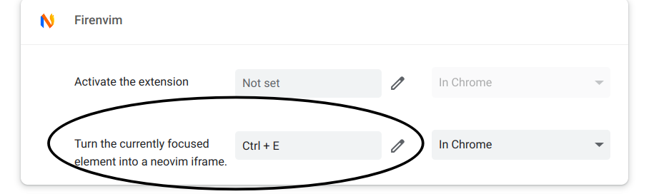

# ysl2/nvim: An ultimate modern neovim pure lua configuration that focuses on KISS principle


> TLDR:
>
> 1. Single main file: There is only one main file `./lua/ysl/init.lua` which contains common configuration and lots of common plugins.
> 2. All things you need: language server support & auto completion & diagnostics, file tree, motion, bookmark, register, edit history, buffer & window control, terminal, git, session save & auto restore like vscode, colors & highlight & outlooks, fuzzy find & global replace, remote ssh, markdown image paste & markdown preview
> 3. Original keymap: I don't like to define many custom keymaps so I try my best to keep native keymaps and only map some functions or applications.
> 4. Very fast: All plugins are lazyloaded so you can gain best performance of this configuration.
> 5. Clean: The files are clean and well structured so that you can easily understand and modify them to fit your needs.
> 6. Choose your own: I provide a local config file `./lua/ysl/localhost.lua` so that you can cover some default settings like: which colorscheme, which lsp backend, which file to require, add your own plugin list. For example, You can select your lsp backend flavor from `./lua/ysl/lsp/nvim_lsp.lua` or `./lua/ysl/lsp/coc.lua`, default is `nvim_lsp`, choose the one you like from these two files, write it into `./lua/ysl/localhost.lua`.
> 7. Integration with others: VSCode's neovim extension support, Chrome input frame edit support.

## Introduction

The configuration is built to fit my needs, might also fit yours. Feel free to use it.

Insights from:

1. Boilerplate: [`kickstart.nvim`](https://github.com/nvim-lua/kickstart.nvim) shows the single file structure, I think it has more benefits than lots of files especially when you're debugging with lots of plugins.
2. Distributions: [`LunarVim`](https://github.com/LunarVim/LunarVim) & [`LazyVim`](https://github.com/LazyVim/LazyVim) & [`NvChad`](https://github.com/NvChad/NvChad) provide the most popular plugins list.
3. Collections: [`awesome-neovim`](https://github.com/rockerBOO/awesome-neovim) provides more special-interest plugins.
4. Personal configs: [`FledgeXu/NeovimZero2Hero`](https://github.com/FledgeXu/NeovimZero2Hero) for minimal lsp & cmp configuration, [`theniceboy/nvim`](https://github.com/theniceboy/nvim) for some useful plugins.
5. Other websites: `chatGPT`, `Google`, `Github`, `Reddit`, `Stackoverflow`, etc.

## Prerequisites, install, update

### Prerequisites

```
NVIM v0.10.0
Build type: Release
LuaJIT 2.1.1723675123
Run "nvim -V1 -v" for more info
```

- Linux/Mac/Windows:
    <!-- - Neovim version >= 0.10.0 -->
    - A build tool: Essential, for enhance telescope performance, choose one below depends on your system.
        - `make` (for MacOS and Linux only)
        - `cmake` (for Windows only)
    - A C compiler `clang` or `gcc` (if Linux/Mac, choose one between them; else if Windows, clang recommended): Essential, for nvim-treesitter support.
    - `ripgrep`: Essential, for fuzzy search and replace.
    - `nodejs` and `yarn`: Essential, for some lsp support, markdown preview, and [`coc`](https://github.com/neoclide/coc.nvim) language server backend support.
    - pip package:
        - pynvim (essential, for coc-snippets and builtin functions support).
    - A `nerd-font`: Optional, but recommended.
    - xsel (For linux: `sudo apt install xsel`)
- Only Windows:
    - [`Visual Studio C/C++ Build Tools` and `Windows SDK`](https://visualstudio.microsoft.com/downloads/) : Only essential for windows users, for telescope-fzf-native.nvim plugin build process.
    - `powershell 7`: Only essential for windows users, for terminal support.

### Install & update

```bash
# Install
# Option 1. On Linux/MacOS
git clone git@github.com:ysl2/nvim.git ~/.config/nvim
# Option 2. On Windows
git clone git@github.com:ysl2/nvim.git %LOCALAPPDATA%\nvim

# Dependencies
pip install pynvim

# Update: Choose an option below.
# Option 1. If you don't add some modification, you can simply pull from the origin url.
git pull origin master
# Option 2. If you have modified some code yourself, you should fetch then you might need to merge your configuration with origin url
git fetch origin && git merge origin/master --no-edit
```

## Project structure tree, and how to replace the default settings with your local configuration

### Project structure tree

```text
❯ tree --dirsfirst
.
├── lua                                |
│   └── ysl                            |
│       ├── lsp                        | Choose one LSP backend between them.
│       │   ├── coc.lua                | Coc LSP backend.
│       │   └── nvim_lsp.lua           | Nvim built-in LSP backend.
│       ├── init.lua                   | Main configuration file.
│       ├── localhost.lua              | Self local configuration, for overriding some default value. Default not exists, needs to be created by yourself.
│       └── utils.lua                  | Some useful functions.
├── scripts                            | Some build scripts stored here.
│   └── build_snippets.py              |
├── templates                          |
│   ├── snippets                       | Snippets folder.
│   │   ├── cython.json -> python.json |
│   │   ├── lua.json                   |
│   │   ├── package.json               | Used by LuaSnip to recognize snippets folder structure.
│   │   └── python.json                |
│   ├── cspell.json                    | Words whitelist for cspell diagnostic in markdown file.
│   └── eisvogel.latex                 | Markdown to Latex template.
├── coc-settings.json                  | Coc settings file.
├── init.lua                           | Project entrance. Nvim will read this file first.
├── lazy-lock-coc.json                 | Plugins version tracking file, for coc branch.
├── lazy-lock.json                     | Only be created when lsp backend is nil. E.g, when you use neovim into vscode by vscode's neovim plugin.
├── lazy-lock-nvim_lsp.json            | Plugins version tracking file, for nvim_lsp branch.
├── LICENSE                            |
└── README.md                          |

6 directories, 19 files
```

### Replace the default settings with your local configuration

Put the code below into `./lua/ysl/localhost.lua`

```lua
-- ./lua/ysl/localhost.lua

local M = {}

-- M.requires, default value: { 'ysl.lsp.coc' }
M.requires = {
  'ysl.lsp.nvim_lsp' -- Use nvim_lsp to override default LSP backend (default: coc).
  -- 'ysl.lsp.coc'
}

-- M.plugins, default value: {}
-- You can add some plugins into the table, lazy.nvim plugins manager will load them.
-- M.plugins = {
--   vim = { 'someone/balabala' },
--   coc = { 'coc-ltex' }
-- }

-- M.config, default value: {}
M.config = {
  utils = {
    github = { -- For swiching to China github mirror.
      ssh = 'git@git.zhlh6.cn:',
      raw = 'https://mirror.ghproxy.com/https://github.com/'
    },
  },
  vim = {
    opt = {
      -- WARNING: Transparency is an experimental feature now.
      -- winblend = 70  -- Uncomment this to enable transparency.
      -- -- M.vim.opt.colorscheme, default value: { 'folke/tokyonight.nvim' }
      -- -- You can specify `colorscheme` to override default colorscheme.
      -- colorscheme = {
      --   {
      --     'folke/tokyonight.nvim',
      --     lazy = false,
      --     priority = 1000,
      --     config = function()
      --       vim.cmd('colorscheme tokyonight-storm')
      --     end
      --   }
      -- }
    }
  }
}


return M
```

## Keymaps

check conflicts example: `:verbose imap`

| key | command | note |
| --- | ------- | ---- |
|     |         |      |

## Systems

### Plugins management system

### Color & outlook system

#### Transparency

Experimental now. Not recommended.

#### GUI font size and color

1. Change font and size:

    ```vim
    set guifont=consolas:h20
    ```

2. Check highlight group:

    ```vim
    " Check the highlight group under cursor:
    :Inspect
    ```

### Session system

### File system

### LSP system

About debugger: My neovim configuration does not provide inner debugger like `nvim-dap`. Integrate an inner debugger is not a hard work, but I prefer using other more powerful outer debugger.

You can find language-specific outer debuggers below.

#### Python

1. Python environment dependencies

    ```bash
    # For coc (not tested on nvim_lsp):
    pip install jedi ruff-lsp sourcery
    ```

    Configure ruff:

    - Linter

        ```jsonc
        // coc-settings.json

        // ruff check --help
        "ruff.lint.args": [
          "--ignore",
          "F401"
        ]
        ```

    - Formatter

        ```jsonc
        // coc-settings.json

        // ruff format --help
        "ruff.format.args": [
          "--config",
          // Ref: https://docs.astral.sh/ruff/formatter/#configuration
          "format.quote-style='single'"
        ]
        ```

2. Python debugger

   Again, my neovim configuration does not provide inner debugger like `nvim-dap`. Integrate an inner debugger is not a hard work, but I prefer using other outer debugger.

   For python, there are several pip libs can support debug. E.g, `pdb`, `ipdb`, `pudb`.

   Another choice is to use some logger like `pysnooper`, `loguru`.

   ```bash
   # pdb is python built-in library, so you don't need to install it via pip. Just import it.
   pip install ipdb pudb pysnooper loguru
   ```

3. sourcery

   This config will auto dynamically read `~/.config/sourcery/auth.yaml`(this is the default sourcery config file) to load the sourcery token.

4. mypy

    ```bash
    # Install stubs
    mypy --install-types
    ```

#### C

For coc, you also need to manually install `clangd`.

`./clang-format` on project root or root's parent folder. See: https://github.com/clangd/coc-clangd/issues/39

#### Rust

```bash
# For coc, rust-analyzer is installed by rustup.
rustup component add rust-analyzer

# For nvim_lsp, rust-analyzer only auto starts for cargo projects.
# To create a cargo project, run the following shell command:
cargo new {project_name}
# If you need to start rust-analyzer for single rust file, you should run neovim command `:RustStartStandaloneServerForBuffer`
```

#### Bash

```text
# For coc
npm install -g bash-language-server
shellcheck>=v0.7
shfmt
```

#### Markdown

```text
# For coc dependencies:
marksman
```

`~/.markdownlint`

#### Latex

1. PDF viewer

    You need to install `zathura` (for Linux/Mac) or `sumatraPDF` (for Windows) pdf viewer, and use `<C-LeftMouse>` or double click `<LeftMouse>` to inverse search. If inverse search does not work, you should `:h vimtex` for more to configure it.

    ```bash
    sudo apt install zathura
    ```

    - There might be a bug when vimtex with sumatraPDF about pdf refresh with xelatex. See `:h vimtex-view-sumatrapdf` for help to fix it (I haven't encounterd this).
    - There might also be a bug when vimtex with zathura about synctex. See `:h vimtex-view-zathura` for help to fix it (I'm lazy to fix this, so I just ignored it).

2. xeletex

    The default latex compiler is `latexmk`, the default compile engine is `pdflatex`.

    If you want to use `xelatex` (for Chinese support) as compile engine in specific project, you should add a `.latexmkrc` in your project root, then add this into this `.latexmkrc`:

    ```
    $pdf_mode = 5;
    ```

    This tells latexmk to use `xelatex` as this project's compile engine. the mode `5` represents `xelatex`. Check vimtex's help doc for more info.

#### Typst

1. Requirements

    ```text
    typst
    # These Below are only for coc:
    typst-lsp
    ```

1. Workflow: Use nvim to edit, it provides syntax lighlighting (`typst.vim`) and lsp completion (`typst-lsp`). Then open an another terminal to manually use `typst watch` command to generate pdf for instant preview.

1. Others: Might not need, and also not provided in this config.

    - Typst instant preview: By `typst-preview.nvim`. Also need `typst-preview v0.10.4` and `websocat v0.12.0` (Follow the instruction of comments in typst-preview.nvim in `./lua/ysl/init.lua`)

#### Multimedia

need `chafa` and press `<LEADER>r` to run `jpg`, `png`, `gif` file and show it's content.

need `pdftoppm` and `chafa` for `pdf` preview.

```
cargo install chafa
```

#### Grammer diagnostic

1. Manually install `ltex-ls`

    - Check current `ltex-ls` version that compatible with `coc-ltex`, for example, `15.2.0`.

    - And manually download and extract the tarball into `~/.config/coc/extensions/node_modules/coc-ltex/lib`

    - Example (need to further check version):

      - Download link : https://github.com/valentjn/ltex-ls/releases/download/15.2.0/ltex-ls-15.2.0-linux-x64.tar.gz

      - Target installation destination: `~/.config/coc/extensions/node_modules/coc-ltex/lib/ltex-ls-15.2.0`

2. Download and extract [ngrams/en.zip](https://languagetool.org/download/ngram-data/ngrams-en-20150817.zip) to `~/.ngrams/en` (need more than 8G disk space).

### Search & global replace system

#### Replace catch (builtin regex)

Let's say you have the following text:

```
Hello, world!
```

You want to replace `Hello` with `Hi` while preserving the original punctuation. You can use the following command:

```
:%s/\(Hello\),/\1, Hi/g
```

After executing this command, the text will become:

```
Hello, Hi world!
```

Another example:

The original string is:

```
\textbf{0.82217}
```

You want to replace it to `0.82217`, you can do this:

```
:%s/\\textbf{\(\d\.\d\+\)}/\1/g
```

### Mark system

### Register & history system

### Motion system

### Buffer & window system

#### Built-in keymaps

- `:bp<CR>`
- `:bn<CR>`
- `<C-6>` or `<C-^>`: For toggle two buffers.

#### Delete buffer

`:bd<CR>` for current buffer but don't save layout.
`:Bd<CR>` for current buffer and keep layout.
`:Bde [opt]` for `all`, `other`, etc.

#### Change CRLF to LF

1. Single file change

    ```vim
    :set ff=unix
    ```

2. Bulk change

    ```sh
    npm install -g crlf2lf
    ```

#### AI context complement

##### Copilot

1. If you're in China you might need to add this into `lua/ysl/localhost.lua`:

    ```lua
    -- lua/ysl/localhost.lua

    vim.g.copilot_proxy = '127.0.0.1:7890'
    ```

2. The copilot key is stored in `~/.config/github-copilot/hosts.json`:

    ```json
    {"github.com":{"user":"your-github-name","oauth_token":"your-key-stored-here"}}
    ```

##### ChatGPT

1. It depends on curl, so you should set the environment variable `$http_proxy` and `$https_proxy` first, like this:

    ```bash
    export http_proxy='127.0.0.1:7890'
    export https_proxy="${http_proxy}"
    ```

2. Add your api key. You can set it into environment variable, or add to a localhost file and custom the read command (follow the official plugin README)

    ```bash
    export OPENAI_API_KEY=your-key
    ```


#### File content diff

##### Whole file diff

1. Vsplit two files left and right into different buffer or window.
2. Focus to the left file, type command `:diffthis<CR>`
3. Focus to the right file, do the same command.
4. To close diff mode, type command `:diffoff<CR>`

##### Part of file diff

1. `:Linediff`

#### File sync scroll

1. Vsplit two buffers.

2. `:set scrollbind` or `:set scb` for each buffer.

3. If you want to turn off sync scroll, use `:set noscrollbind` or `:set noscb`.

### Terminal system

### Miscellaneous

#### With VSCode

#### With Browser like Chrome, Firefox, etc.

You should comment the `cond = not not vim.g.started_by_firenvim,` line for the first time. Then restart nvim, the firenvim will be installed. After installed, you should uncomment it.

If you not sure whether the firenvim is builded, you can first comment this line, then manually call `:call firenvim#install(0)` to build firenvim, then uncomment it.

Then you should set the keymap `Turn the currently focused element into a neovim iframe.` to `<C-e>` in `chrome://extensions/shortcuts`:



press `ctrl+e` in the browser input dialogue to open nvim.

#### Applications

##### Wakatime

Install `wakatime-cli`.

##### Lazygit

Install `lazygit`.

##### Lf

## My forked plugins list

## Tricks

```lua
-- Silent save.
vim.keymap.set('n', ':w<CR>', '<CMD>silent w<CR>', { silent = true })

-- No pain to read source code.
vim.keymap.set('n', 'gD', function ()
  vim.fn['CocAction']('jumpDefinition', 'vsplit')
  vim.cmd('normal zt')
end, { silent = true })

-- For changing hlslens `n` and `N` keys to keep the searched words in the middle line of screen.
n -> nzzzv
N -> Nzzzv
```
